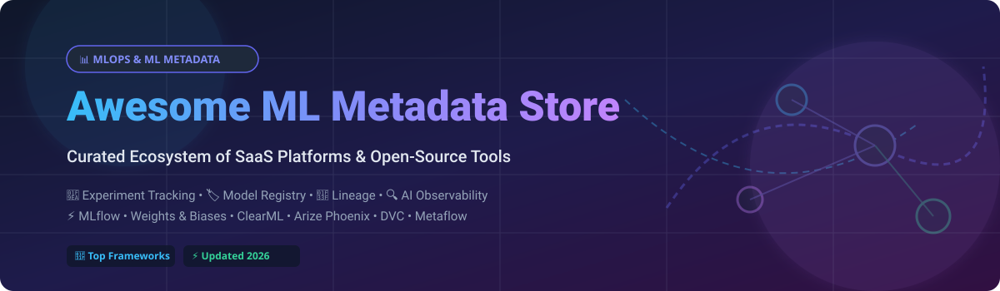

  

<h1 align="center">Awesome ML Metadata Store 📊</h1>

  <strong>A curated list of top SaaS platforms and open-source GitHub projects for Machine Learning Metadata Stores, Experiment Tracking, Model Registries, Lineage, and MLOps Observability.</strong>

  
  
  
  
  

---

## 📌 Overview & SEO Summary

**ML Metadata Store** technologies are the backbone of modern **MLOps (Machine Learning Operations)** and **AI Engineering**. They systematically capture, store, query, and manage experiment hyperparameter tracking, model versioning, data lineage graphs, artifact metadata, and LLM evaluation tracing. 

Whether you are comparing hyperparameters in deep learning models, auditing ML pipelines for enterprise compliance, or tracing LLM agent executions in production, selecting the right metadata store ensures full reproducibility and governance across the AI lifecycle.

---

## 📖 Table of Contents
- [🌐 Market Overview & Dynamics](#-market-overview--dynamics)
- [☁️ SaaS & Managed Platforms](#️-saas--managed-platforms)
- [🔓 Open-Source GitHub Projects](#-open-source-github-projects)
- [💡 Architecture & Framework Recommendations](#-architecture--framework-recommendations)
- [🤝 How to Contribute](#-how-to-contribute)
- [💖 Support & Sponsor](#-support--sponsor)
- [📈 Star History](#-star-history)
- [⚠️ Disclaimer](#️-disclaimer)

---

## 🌐 Market Overview & Dynamics

> **Estimated Market Size & Structure**: The global MLOps and ML Metadata / Observability market size is estimated at **$1.8 Billion – $2.5 Billion (2026)** with a projected CAGR exceeding 30%. The market is **moderately fragmented** — while hyper-scalers (AWS SageMaker, Google Cloud Vertex AI) and Databricks (MLflow) lead enterprise adoption, specialized platforms (Weights & Biases, Arize, Comet, Neptune) compete aggressively on advanced LLM tracing, hyperparameter visualization, and developer experience.

---

## ☁️ SaaS & Managed Platforms

The table below lists leading commercial SaaS and managed platforms for ML metadata, sorted descending by company scale (valuation / annual revenue).

| SaaS Platform 🚀 | Market Scale / Valuation / Revenue 🏢 | Pricing (Starting Tier) 💵 | Free Tier / Trial Limits 🎁 | Description 📝 |
| :--- | :--- | :--- | :--- | :--- |
| **[Amazon SageMaker Lineage](https://aws.amazon.com/sagemaker/)** | **$100B+** (AWS MLOps Division) | $0.40/hour per notebook instance (pay-as-you-go) | 2 months free trial with 250 hours of ml.t3.medium per month | Enterprise ML lineage and metadata integration inside AWS SageMaker pipelines. |
| **[Vertex AI Metadata](https://cloud.google.com/vertex-ai)** | **$50B+** (Google Cloud AI Division) | $0.02 per 1,000 metadata store operations | $300 free credits for 90 days across Google Cloud | Fully managed metadata and artifact lineage service built into Google Cloud Vertex AI. |
| **[MLflow (Databricks Managed)](https://mlflow.org/)** | **$43 Billion** Valuation | $0.07 per Databricks Unit (DBU) / ~$99/mo starter | 14-day free trial with full platform access | Fully managed MLflow hosted on Databricks with enterprise governance and compute integrations. |
| **[Weights & Biases](https://wandb.ai/)** | **$1.25 Billion** Valuation | $50/user/month (Team Plan) | Free Forever for individuals with 100 GB artifact storage | Industry-standard experiment tracking, hyperparameter sweeps, and LLM evaluation with Weave. |
| **[Comet ML](https://www.comet.com/)** | **$150 Million** Valuation | $179/month (Startup/Team tier) | Free Forever for individual researchers with 1 user limit | Full MLOps platform featuring experiment tracking, model registry, and production monitoring. |
| **[Fiddler AI](https://www.fiddler.ai/)** | **$100 Million** Valuation | $500/month estimated starting tier | 14-day free trial upon request | Enterprise model observability, explainability, and production metadata tracking platform. |
| **[ClearML Hosted](https://clear.ml/)** | **$80 Million** Valuation | $15/user/month (Pro Tier) | Free Forever for up to 3 team members with 100 GB storage | Cloud-hosted MLOps platform covering experiment tracking, pipeline orchestration, and data versioning. |
| **[Arize AI Platform](https://arize.com/)** | **$75 Million** Valuation | $50/month (Team tier) | Free Forever (Phoenix OSS) & 14-day enterprise trial | Comprehensive AI observability, prompt engineering evaluation, and ML metadata management. |
| **[Neptune.ai](https://neptune.ai/)** | **$30 Million** Valuation | $49/month (Team Plan) | Free Forever for individual projects with 200 hours tracking/mo | Metadata-focused experiment tracker optimized for complex run querying and flexible metrics loggers. |

---

## 🔓 Open-Source GitHub Projects

Below are top open-source ML metadata store libraries, experiment trackers, and MLOps platforms, sorted descending by GitHub star count ⭐.

| Open-Source Project 🛠️ | GitHub Stars ⭐ | Primary Focus 🎯 | Description 📝 |
| :--- | :---: | :--- | :--- |
| **[MLflow](https://github.com/mlflow/mlflow)** |  | Experiment Tracking & Model Registry | The most popular open-source platform for ML experiment tracking, evaluation, agent tracing, and model registries. |
| **[DVC](https://github.com/iterative/dvc)** |  | Data Versioning & Experiment Track | Git-native data and model version control paired with lightweight experiment tracking. |
| **[Arize Phoenix](https://github.com/Arize-ai/phoenix)** |  | LLM Tracing & AI Observability | Open-source AI observability and evaluation library for tracing LLM applications, prompts, and ML metadata. |
| **[ClearML](https://github.com/allegroai/clearml)** |  | Full MLOps & Experiment Tracking | Open-source MLOps suite integrating experiment tracking, pipeline orchestration, and data/model management. |
| **[Kedro](https://github.com/kedro-org/kedro)** |  | Data Catalog & Pipeline Metadata | Production-grade Python framework for creating reproducible, maintainable, and modular data science pipelines. |
| **[Hydra](https://github.com/facebookresearch/hydra)** |  | Config & Run Metadata Management | Framework by Meta AI for dynamically configuring complex Machine Learning applications and experiments. |
| **[Metaflow](https://github.com/Netflix/metaflow)** |  | Real-World ML & Artifact Tracking | Human-friendly Python/R framework originally built at Netflix for managing data science pipelines and artifact state. |
| **[Flyte](https://github.com/flyteorg/flyte)** |  | Workflow Orchestration & Lineage | Production-grade orchestrator built for data and ML pipelines with strong execution metadata and lineage. |
| **[Aim](https://github.com/aimhubio/aim)** |  | Fast UI Experiment Tracker | Modular, self-hosted experiment tracking tool featuring a high-performance UI and deep metadata search capabilities. |
| **[ZenML](https://github.com/zenml-io/zenml)** |  | Extensible MLOps & Lineage | Extensible open-source MLOps framework to connect experiment trackers, artifact stores, and orchestrators. |
| **[Google ML Metadata (MLMD)](https://github.com/google/ml-metadata)** |  | Standardized Workflow Lineage | Core library for recording metadata in ML pipelines; powers TensorFlow Extended (TFX) and Kubeflow Metadata. |
| **[Polyaxon](https://github.com/polyaxon/polyaxon)** |  | Cloud-Native ML Experimentation | Kubernetes-native platform for managing, tracking, and orchestrating Machine Learning and Deep Learning jobs. |
| **[Sacred](https://github.com/IDSIA/sacred)** |  | Lightweight Experiment Logging | Python tool to configure, organize, log, and reproduce machine learning experiments alongside tools like Omniboard. |
| **[Guild AI](https://github.com/guildai/guildai)** |  | Zero-Code Instrumentation Tracker | Open-source run capture and tracking tool that works with existing scripts without code modifications. |
| **[Kubeflow Metadata](https://github.com/kubeflow/metadata)** |  | Pipeline Execution Tracking | Component for tracking artifact and execution metadata within legacy and integrated Kubeflow pipelines. |

---

## 💡 Architecture & Framework Recommendations

- 🚀 **Broadest Ecosystem & Model Registry**: Choose **MLflow** for robust artifact tracking, zero-lock-in self-hosting, and widespread industry adoption.
- ⚡ **All-In-One MLOps Stack**: Opt for **ClearML** if you need experiment logging combined with remote worker execution and orchestration.
- 🤖 **LLM Tracing & Prompt Metadata**: Use **Arize Phoenix** for modern generative AI applications, agent call stacks, and RAG evaluation.
- 🌿 **Git-Native Data Versioning**: Pair **DVC** with your repositories for tracking large dataset versions and model binaries directly alongside source code.
- 🏗️ **Formal Lineage Graphs**: Integrate **Google ML Metadata (MLMD)** with Kubeflow or TFX pipelines when auditing compliance and dataset transformation chains.

---

## 🤝 How to Contribute

Contributions are welcome! Help us keep this directory up-to-date:

1. 🍴 **Fork** this repository.
2. 📝 **Add or update** entries in `README.md` following the table format.
3. 🔍 **Ensure** factual details for pricing, free tier specs, valuation/scale, and official URLs.
4. 📬 **Submit a Pull Request** with a clear explanation of your changes.

---

## 💖 Support & Sponsor

Thank you for exploring this curated collection of ML metadata stores and MLOps ecosystem projects! 

If you find this repository valuable for your research, projects, or organization, please consider:
- ⭐ **Starring** this repository to increase visibility.
- 🍴 **Forking** and sharing with fellow ML engineers and data scientists.
- ☕ **Sponsoring / Buying a Coffee**: You can support ongoing maintenance and content curation via [GitHub Sponsors](https://github.com/sponsors/ishandutta2007).

Your support is deeply appreciated! 🙌

---

## 📈 Star History

---

## ⚠️ Disclaimer

- This repository is a **community-curated list** for informational and research purposes only.
- ML metadata stores often handle sensitive model weights, customer telemetry, and parameters. Ensure proper encryption, identity access management (IAM), and compliance retention policies when deploying self-hosted or cloud metadata stores.

---

  Made with ❤️ for ML Engineers, Data Scientists, and MLOps Practitioners.

